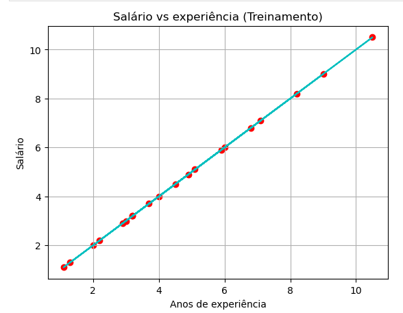
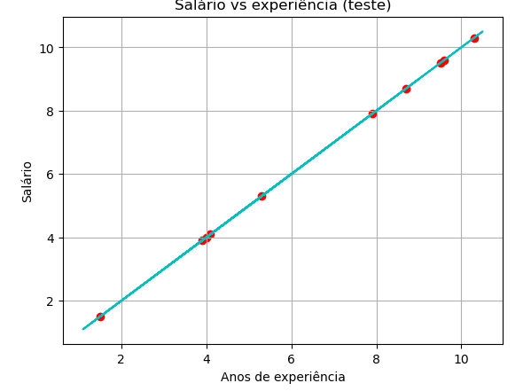

# Regressão Linear: Experiência vs. Média Salarial

Este projeto realiza uma análise de regressão linear simples para prever a média salarial com base nos anos de experiência. O modelo foi desenvolvido utilizando as bibliotecas `sklearn`, `pandas` e `matplotlib`, gerenciadas pelo ambiente Anaconda.

## Pré-requisitos

Certifique-se de ter o Anaconda instalado e um ambiente configurado com os pacotes necessários.

### Passos para Configurar o Ambiente

1. **Crie um ambiente no Anaconda**:
    ```bash
    conda create --name regressao-linear python=3.9
    ```

2. **Ative o ambiente**:
    ```bash
    conda activate regressao-linear
    ```

3. **Instale os pacotes necessários**:
    ```bash
    conda install scikit-learn pandas matplotlib
    ```

## Descrição

Este projeto visa prever a média salarial com base nos anos de experiência de um profissional. O modelo utiliza um conjunto de dados simples, com duas colunas:

- **Experiência (anos)**: Representa o número de anos de experiência.
- **Salário**: A média salarial associada a essa experiência.

Utilizamos a regressão linear para modelar a relação entre essas duas variáveis e prever salários para novos dados de anos de experiência.

## Arquivos no Repositório

- `regressao_linear.py`: Script principal que carrega os dados, treina o modelo de regressão linear e exibe os resultados.
- `salarios.csv`: Conjunto de dados contendo as colunas de **Experiência (anos)** e **Salário**.
- `requirements.txt`: Lista de pacotes e suas versões para instalar via conda ou pip, se necessário.

## Como Executar

Após instalar os pacotes e configurar o ambiente, execute o script:

  ```bash
  python regressao_linear.py
```

## Gráficos de treinamento
Estes gráficos fazem a correlação de anos de expericia e salário, divididos em treinamento e teste. 

<div style="display: flex; justify-content: space-between;">
  <div style="flex: 1; text-align: center;">
    <h4>Gráfico de Treinamento</h4>
    
  </div>
  <div style="flex: 1; text-align: center;">
    <h4>Gráfico de Teste</h4>
    
  </div>
</div>
